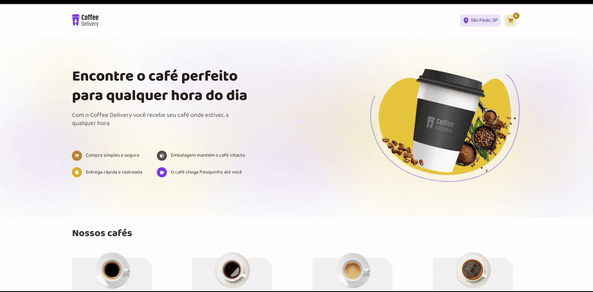

# Coffee Delivery

Esse projeto visa simular uma plataforma de vendas on-line para uma cafeteria, onde o usuário pode selecionar os itens desejados e realizar o seu pedido. 

O projeto foi desenvolvido em React com base no layout Figma da Rocketseat e faz parte de um desafio da trilha de aprendizado do curso ReactJS. 

O link do figma está disponível aqui: https://www.figma.com/design/5yT9ZzZmRQRS4yivGGB3pl/Coffee-Delivery-%E2%80%A2-Desafio-React/duplicate



## Quer testar?

Caso queira testar, basta seguir os seguintes passos:

- Faça um clone do código para o seu repositório local:
  
```js
git clone https://github.com/Emanuel-Cordeiro/Coffee-Delivery
```

- Instale as dependências necessárias atra´ves do `npm`:

```js
npm install
```

- Execute o seguinte comando para validar o projeto no navegador:

```js
npm run dev
```
